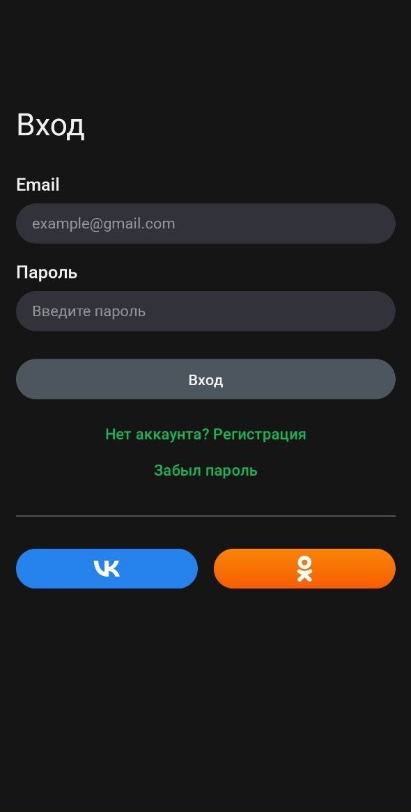
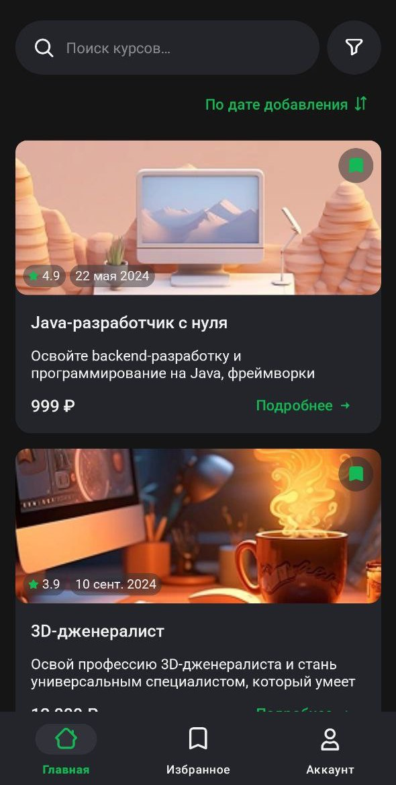
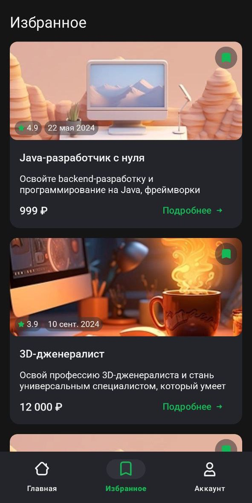
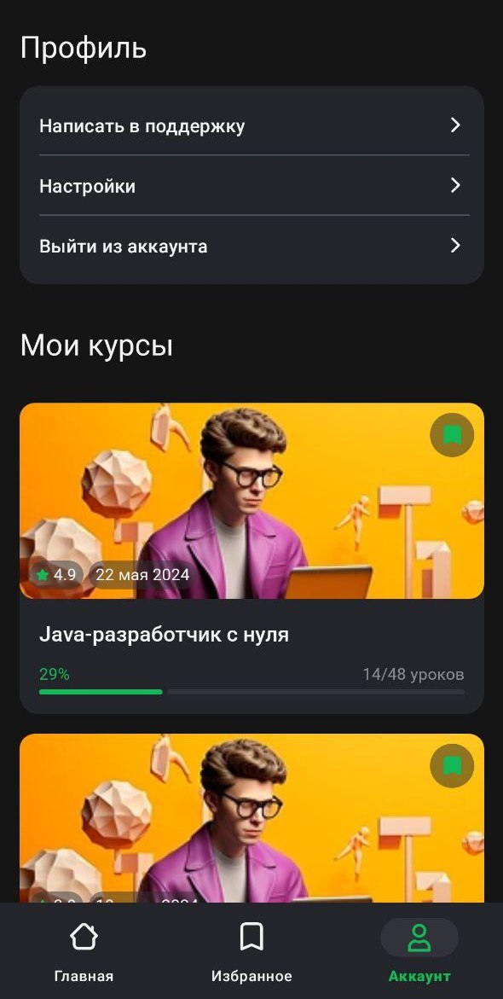

# Courses

Тестовое задание для компании Effective Mobile.

**Стек технологий:**

- Kotlin
- MVVM
- Retrofit 
- Coroutines
- LiveData
- Hilt
- Room
- AdapterDelegates
- XML
- Cicerone 
- Clean Architecture
- MVVM
- Multimodules

**Скриншоты**

| Логин | Главный экран |
|--|--|
|  |  |
| Избранное | Аккаунт |
|  |  |

